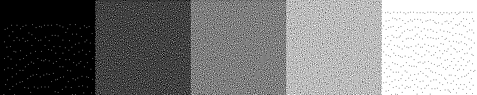

# Structure-aware dithering algorithms

The Floyd-Steinberg error diffusion algorithm, introduced in 1975, remains one of the most widely used error-diffusion dithering algorithms today. Its popularity can likely be attributed to its excellent tone-preservation properties, ease of implementation, and the abundance of available implementation examples online.

However, it is not without issues. The algorithm often produces slightly blurred images with some loss of detail, as well as visually disruptive worm- and alignment-artifacts in or at certain intensity levels. These problems are particularly pronounced when working with bi-level images.

This repository explores several newer, structure-aware algorithms that have been published over the years. These modern algorithms generally offer much higher detail preservation and avoid the disruptive artifacts commonly seen with Floyd-Steinberg dithering.

Please note that many of the algorithms implemented here were developed only by referencing the papers cited at the bottom of this page, often involving a bit of trial and error to achieve visually pleasing results. It is *very likely* that I have made mistakes during the implementation process, so please feel free to get in touch if you spot any errors or have suggestions on how to improve the accuracy of these implementations.

My primary use case for implementing these algorithms has been thermal printing, but it's likely that they can enhance the output of other bi-level technologies as well, such as e-ink displays, laser engraving, and others.

## Example images

> [!NOTE]
> Your web browser may not display these images correctly due to bilinear scaling. Please save the images to your computer and open them with a proper image viewer.

### David

**Original**

**Floyd-Steinberg to the left, a structure-aware algorithm on the right**

**These commands were used to generate the images above**

    dither examples/david-original.png examples/david-floyd-steinberg.png classic
    dither examples/david-original.png examples/david-visual-difference.png visual-difference

### Ribbon

**Original**

**Floyd-Steinberg to the left, a structure-aware algorithm on the right**

**These commands were used to generate the images above**

    dither examples/ribbon-original.png examples/ribbon-floyd-steinberg.png classic
    dither examples/ribbon-original.png examples/ribbon-contrast-aware-variant.png contrast-aware-variant

### Cat

**Original**

**Floyd-Steinberg to the left, a structure-aware algorithm on the right**

**These commands were used to generate the images above**

    dither examples/cat-original.png examples/cat-floyd-steinberg.png classic
    dither examples/cat-original.png examples/cat-zhangpang.png zhangpang

### Snail

**Original**

**Floyd-Steinberg to the left, a structure-aware algorithm on the right**

**These commands were used to generate the images above**

    dither examples/snail-original.png examples/snail-floyd-steinberg.png classic
    dither examples/snail-original.png examples/snail-contrast-aware-variant.png contrast-aware-variant

### Gradient steps

This image has been generated to highlight how each algorithm behaves at certain problematic levels that usually result in a lot of undesirable artifacts.

**Original**

**Floyd-Steinberg**

Tons of worms and other artifacts.

**Ostromoukhov**

Notice the total lack of worms, but there's still some unsightly artifacts at the midlevel.

**Zhoufang**

No artifacts at the midlevel.

**Laplacian**

**Contrast Aware Halftoning (basic method)**

The basic method processes the image in raster order, causing quite a few artifacts.

**Contrast Aware Halftoning (variant method)**

The variant method uses a priority queue to process each pixel. Notice how it also slightly increases the contrast, resulting in pure black and pure white at the extreme ends of the gradient.

**Entropy-Constrained Zhoufang**

**Visual Difference**

**Zhang-Pang**

### Gradient linear

**Original**

**Floyd-Steinberg**

**Ostromoukhov**

**Zhoufang**

**Laplacian**

**Contrast Aware Halftoning (basic method)**

**Contrast Aware Halftoning (variant method)**

**Entropy-Constrained Zhoufang**

**Visual Difference**

**Zhang-Pang**

## Run-time statistics

Average run-time of 10 runs on the same input image, in seconds.

- Floyd Steinberg **3.286**
- Ostromoukhov **3.982**
- Zhoufang **4.652**
- Laplacian **5.986**
- Contrast Aware Halftoning (basic method) **26.752**
- Contrast Aware Halftoning (variant method) **67.034**
- Entropy-Constrained Zhoufang **4.846**
- Visual Difference **10.826**
- Zhangpang **4.913**

## Command Line Interface

    Usage: dither.py [OPTIONS] INPUT OUTPUT COMMAND [ARGS]...

    Options:
      --srgb-to-linear / --no-srgb-to-linear
                                      Whether or not to convert the input image
                                      from sRGB to linear space before halftoning
                                      [default: no-srgb-to-linear]
      --resize-width INTEGER          Resizes the input image to the given width
                                      before halftoning
      --resize-resample [nearest|bilinear|bicubic|lanczos|box|hamming]
                                      Resampling algorithm to use when resizing
      --duplicate-first-rows-and-cols / --no-duplicate-first-rows-and-cols
                                      Duplicates the first rows and columns of the
                                      image to avoid border startup-artifacts
                                      [default: no-duplicate-first-rows-and-cols]
      --contrast FLOAT                Adjusts contrast of the input image before
                                      halftoning, raise this value to increase
                                      contrast and vice versa  [default: 1.0]
      --sharpness FLOAT               Adjusts sharpness of the input image before
                                      halftoning, raise this value to increase
                                      sharpness and vice versa  [default: 1.0]
      --brightness FLOAT              Adjusts brightness of the input image before
                                      halftoning, raise this value to increase
                                      brightness and vice versa  [default: 1.0]
      --invert / --no-invert          Invert result *after* halftoning  [default:
                                      no-invert]
      --gamma FLOAT                   Manual gamma adjustment  [default: 1.0]
      --scale-low FLOAT               Performs scaling of the input image
                                      intensity levels by linear interpolation to
                                      this minimum value  [default: 0.0]
      --scale-high FLOAT              Performs scaling of the input image
                                      intensity levels by linear interpolation to
                                      this maximum value  [default: 1.0]
      --help                          Show this message and exit.

    Commands:
      bayer                           Ordered dithering by Bayer matrices
      classic                         Classic 1970s error diffusion with...
      contrast-aware-basic
      contrast-aware-variant
      entropy-constrained
      entropy-constrained-ostromoukhov
      entropy-constrained-zhoufang
      laplacian
      ostromoukhov                    A simple and efficient error...
      threshold                       Simple intensity thresholding, with...
      visual-difference
      whitenoise                      Random intensity thresholding
      zhoufang

### Installation instructions

    git clone https://github.com/dalpil/structure-aware-dithering
    cd structure-aware-dithering
    uv run dither

### Example usage

    uv run dither --resize-width 512 input.png output.png classic --kernel atkinson
    uv run dither input.png output.png zhangpang --c 0.0065
    uv run dither --resize-width 512 input.png output.png contrast-aware-variant

## References

[1]: V. Ostromoukhov, ["A simple and efficient error-diffusion algorithm"](https://perso.liris.cnrs.fr/victor.ostromoukhov/publications/pdf/SIGGRAPH01_varcoeffED.pdf), 2001

> A set of diffusion coefficients that bring the Fourier spectra of each key intensity level as close as possible to the "blue-noise" spectra.
>
> Theoretically faster than Floyd-Steinberg due to that fact that the error is distributed to only 3 of the neighbouring pixels, following a serpentine path.

[2]: B. Zhou and X. Fang, ["Improving mid-tone quality of variable-coefficient error diffusion using threshold modulation"](https://www.wict.pku.edu.cn/GraphicsLab/docs/20200416110604416469.pdf), 2003

> Improves the mid-tones of [1] by adding various amounts of noise to key intensity levels where annoying artifacts tend to appear.
>
> If you don't care about structure preservation and just need a algorithm that has excellent, artifact-free tone reproduction, this is probably what you should use instead of plain F-S.

[3]: H-S. Lee & K-K. Kong & K-S Hong, ["Laplacian based structure-aware error diffusion"](https://www.researchgate.net/profile/K-K-Kong/publication), 2010

> Utilises a modified laplacian filter and random noise for threshold modulation of the Floyd-Steinberg algorithm.
>
> This algorithm produces good results while being conceptually simple, easy to implement and almost as fast as regular Floyd-Steinberg.

[4]: H. Li & D. Mould, ["Contrast-aware Halftoning"](https://people.scs.carleton.ca/~mould/papers/ContrastAwareHalftoning-final.pdf), 2010

> A novel error diffusion algorithm where the error is spread to neighbouring pixels within a circular mask with a steep drop-off from the centre, either in a raster scanline order (the basic variant) or in a priority-based order depending on the distance of the current pixel intensity from white or black.
>
> Exceptionally well written, and an enjoyable read. The proposed algorithm is easy to understand and implement.

[5]: L. Liu et al., ["Structure-aware error-diffusion approach using entropy-constrained threshold modulation"](https://link.springer.com/article/10.1007/s00371-013-0895-0), 2013

[6]: X. Shi & X. Li, ["An improved error diffusion algorithm based on visual difference"](https://projet.liris.cnrs.fr/imagine/pub/proceedings/ICIP-2014/Papers/1569901225.pdf), 2014

> A visual difference is calculated between the original grayscale image and halftone image after applying the Floyd-Steinberg algorithm. The input image is then adjusted/compensated by this difference and fed back into the same process again. This is repeated 3-5 times before being processed by a Ranked-order Adaptive Median Filter (RAMF, to remove impulse noise and reduce edge artifacts) and a threshold-modulated (gaussian random) Floyd-Steinberg algorithm to remove disturbing artifacts at certain levels.

[7]: F. Zhang & M. Pang, [Rapidly Creating Structure-aware Halftoning with Improved Error Diffusion](https://ieeexplore.ieee.org/document/5303919), 2009

> Extends the Ostromoukhov and Zhou-Fang algorithms by calculating a value for "local visual information of texture feedback" (ITF), which is added to the input of the quantizer function to enhance texture and edges in the halftoned image. Easy to implement in a few lines of code, and produces sharp looking halftones quickly.
